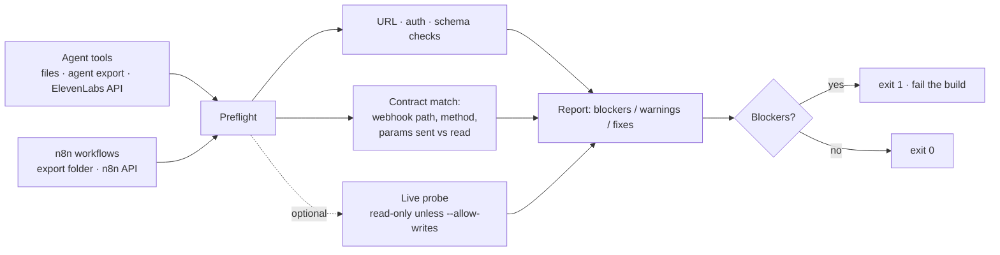

# Agent Preflight: catch what will break a voice agent before a caller does

A pre-production checker for **ElevenLabs voice-agent tools and the n8n workflows behind them**. It reads both halves, compares them, and lists what will break and how to fix it. The **exit code is 1 when there are blockers**, so it can gate a CI pipeline. It runs as a CLI, in CI, or as a web app.

Python 3.10+, **standard library only** (the web app adds FastAPI).

> **Status:** complete. 34 tests, including a copy of a real agent's config with planted faults and a stand-in n8n server that misbehaves on command. A live run against a production ElevenLabs agent and n8n instance is documented in [docs/live-run.md](docs/live-run.md) but not yet claimed.

## Why

- **Voice agents fail in production for dull reasons:**
  - a tool still points at a **test** webhook
  - a parameter is called `phone` on one side and `phone_number` on the other
  - a workflow is inactive
  - a secret is still `PASTE_…_HERE`
- **None of that is visible from either side alone.** The agent's tools and the workflows behind them are two halves of a contract that nobody checks, and the break only appears when a caller is on the line.
- **A report nobody fails on is a report nobody reads,** so blockers set the exit code.

## How it works



1. **Load the tools** from tool files, an agent export or the ElevenLabs API.
2. **Index the n8n webhooks** and follow the nodes downstream of each, collecting the `body.*` fields they actually read.
3. **Compare the two halves:**
   - Is the URL a real production webhook?
   - Does auth match?
   - Is the schema complete?
   - Do the parameters the tool sends match the fields the workflow reads, in both directions?
4. **Optionally call each webhook for real.** This is read-only by default: tools that change data are skipped unless `--allow-writes` is set.
5. **Report** every finding as a blocker or a warning, with a fix.

## What it checks

| Area | Blockers | Warnings |
|---|---|---|
| Tool URL | `/webhook-test/` URL, localhost/ngrok/tunnel URL, not https, placeholder host | |
| Auth | placeholder or empty secret; n8n requires auth but the tool sends none | webhook has no auth; auth stored as plain text |
| Schema | `required` field not defined, empty enum | param has no description, LLM-filled `conversation_id`, weak tool description, timeout over 20 s |
| n8n match | no webhook on that path, method mismatch, node disabled, workflow inactive, no Respond to Webhook node, param name mismatch (`phone` vs `phone_number`), unfilled `PASTE_…`/`REPLACE_…` values | param never read, field read but never sent, responds before the work is done |
| Live probe | 401/403, 404, non-2xx, timeout or unreachable, response over 15,000 chars | non-JSON reply, slower than 3 s |

## Usage

Check files only, with no network:
```bash
python3 -m preflight --tools path/to/agent/tools --n8n path/to/n8n --out reports/agent.md
```

Check the live configs, read-only:
```bash
ELEVENLABS_API_KEY=... N8N_API_KEY=... python3 -m preflight --agent-id <agent_id> --n8n-url https://your-n8n
```

Also call each webhook. Tools that change data are skipped unless you add `--allow-writes`:
```bash
python3 -m preflight ... --probe --auth-header "Bearer <secret>" --only verify_caller
```

Run the tests:
```bash
python3 -m unittest discover -s tests -t .
```

### Web app

```bash
python3 -m venv .venv && .venv/bin/pip install -r requirements.txt
```
```bash
.venv/bin/uvicorn web.app:app --port 8000
```

Then open http://127.0.0.1:8000.
- **Paste** a tools folder and an n8n folder, or open "Read live configs" and give an agent id and API keys. **Keys are used for that one check and never stored.**
- **Live calls:** "Call each webhook for real" is off by default. "Send calls here instead" points it at a test server.
- **Results:** each tool row expands to show its findings, fixes and live-call timing, and the whole report downloads as Markdown.

**Hosted mode** (for example on Render) requires uploads instead of file paths, a password, and public https addresses only. That stops the server being used to probe private networks. See [docs/deploy.md](docs/deploy.md).

## Testing without touching anything real

`tools/fake_n8n.py` stands in for n8n. It reads the agent's tool files, serves every path they point at, and misbehaves on the tools you name.

```bash
python3 tools/fake_n8n.py --tools "<agent>/agent/tools" --port 8099 --secret "Bearer test-secret" \
    --slow verify_caller --error create_ticket --big get_ticket_status --text assess_request --missing find_branch_or_atm
```
```bash
python3 -m preflight --tools <tools> --n8n <workflows> \
    --probe --base-url http://127.0.0.1:8099 --auth-header "Bearer test-secret" --allow-writes
```

**The faults it can fake:**
- `--slow`: waits `--delay`, 6 seconds by default
- `--error`: HTTP 500
- `--big`: a reply over the size limit
- `--text`: plain text instead of JSON
- `--missing`: 404, like an inactive workflow

`tests/test_fake_server.py` runs this whole loop automatically.

## Results on a real agent

Run against the **[ENTIN Bank voice agent](https://github.com/nwanduben/ai-voice-banking-support-demo)** (13 tools), a static check reported **14 blockers**. They included:
- **every tool file** still carrying a placeholder secret
- an unfilled `PASTE_ELEVENLABS_WEBHOOK_SECRET_HERE` in the post-call workflow
- a `note` field that `report_security_event` sends but no workflow node ever reads

With the fake server, the probe path was proven end to end: 13 tools, 7 pass, 3 warn, 3 fail. These are exactly the contract failures that neither system can see on its own.

## Verified

- ✅ **34 tests.** The 12 web-app tests skip unless FastAPI is installed. The tests include:
  - a deliberately broken copy of a real agent's config with **seven planted faults, all caught**
  - parameter mismatches reported **in both directions**
  - **a blocker must set the exit code**
- ✅ **The probe path, proven against the stand-in n8n server:** slow, HTTP 500, oversized reply, plain text instead of JSON, and a missing workflow.

## Not yet verified

- A read-only run against a live ElevenLabs agent and n8n instance. It needs production keys; the steps are in [docs/live-run.md](docs/live-run.md).

## Repo layout

| Path | What it is |
|---|---|
| `preflight/elevenlabs.py` | Loads tools from tool files, an agent export or the API |
| `preflight/n8n.py` | Indexes webhooks, follows downstream nodes, finds the `body.*` fields they read |
| `preflight/checks.py`, `probe.py` | The checks and the live calls |
| `preflight/runner.py`, `report.py`, `cli.py` | Orchestration, the Markdown/JSON report, and the command line |
| `web/` | FastAPI web app (`app.py`) and its single-page UI |
| `tools/fake_n8n.py` | The stand-in n8n server |
| `tests/` | Fixtures with planted faults, the fake-server loop, and hosted-mode and web tests |
| `docs/` | `project-kickoff.md` (goal, six Ps, decisions), `deploy.md`, `live-run.md` |
| `Dockerfile`, `render.yaml` | Container and Render deployment |
